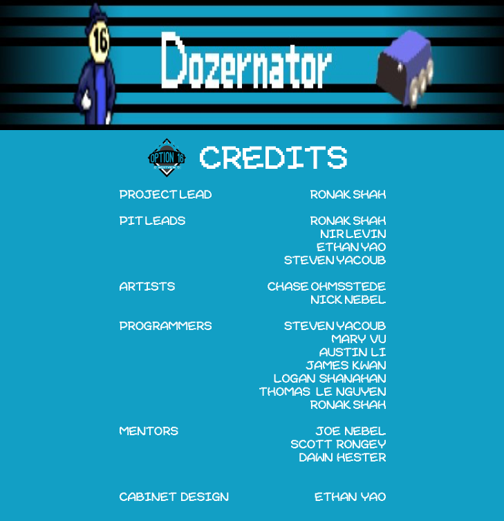

# Arcade Game

@Devs: NOTE: Before ever doing work on the game, make sure [to get changes from the base](#getting-changes) 

Table of Contents
-----------------
1. [Releases](#releases)
2. [Contributors](#contributors)
3. [Developing the Game](#developing-the-game)
 1. [Getting the Game](#getting-the-game-for-development-use)
 2. [Adding a Game](#adding-a-game)
 3. [Getting Changes](#getting-changes)

Releases
========

Download the latest version from the [releases](https://github.com/ronakdev/arcadegame/releases) page, or play it [online](https://ronakshah.net/arcadegame/)

Contributors
============

Developing the Game
===================

Getting the Game for Development Use
-------------

1.  [Fork the Repo](https://www.google.com/url?q=https://github.com/ronakdev/arcadegame/fork&sa=D&ust=1519791593216000&usg=AFQjCNEL5EqWTgD3hLTBXWV8lGy5OP-yMQ)
2.  Open Git Bash / Terminal

3.  Run command: 

` git pull https://github.com/<your_username>/arcadegame`

5.  Open Folder in Unity
6.  Done!

Adding a Game
-------------

1.  Import unity package
2.  Make a folder in `Scenes/<GameName>`

1.  There should be a` Sprites` folder, and a `Scripts` Folder
2.  The Scene Name must be called the same as your ALERT WORD
3.  Add the following code to your win/lose functions

For win

    if (win) { //however you check this
    
            Main.status = “win-mg”;
            SceneManager.LoadScene(“Transition”); // make sure to have the right imports for this
    
    }

For lose

	if (win) { //however you check this

	        Main.status = “lose-mg”;
	        SceneManager.LoadScene(“Transition”); // make sure to have the right imports for this

	}

3.  Go to `Build Settings` and `Add Open Scenes`
4.  Go to `Main.cs` (located in `Scenes/TitleScreen/Scripts` and alter the array so your game is included

1.  The **name of the game** MUST match not only the name of the scene, but also the name of the ALERT WORD

5.  Push to Github

	git add -A
	git commit -m “Your Message”
	git push

 1.  Submit a Pull Request

Getting Changes
---------------
1.  `git pull upstream master`

1.  If you never setup `upstream` paste in the below code after cding into the appropriate directory

    `git remote add upstream https://github.com/ronakdev/arcadegame`
    
    `git pull upstream master`
